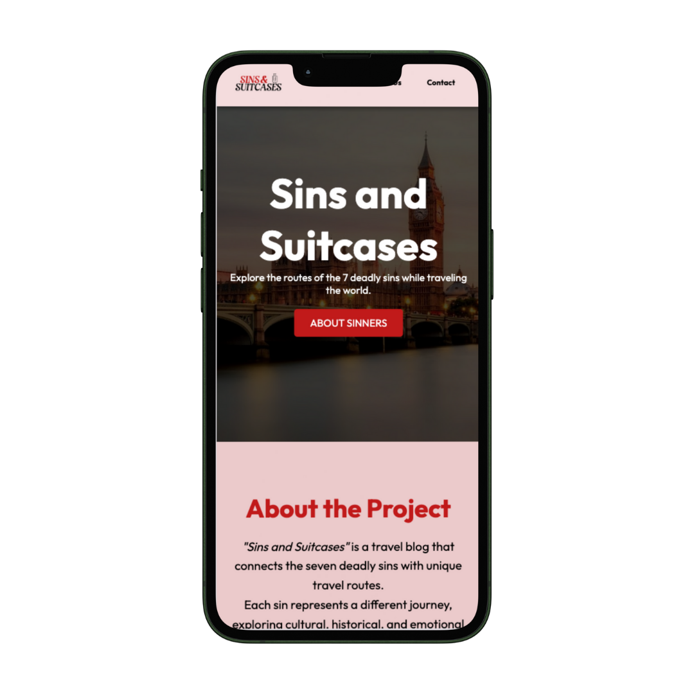

# Sins and Suitcases

Repositório para hospedar o projeto desenvolvido para Tecnologias Web, cadeira de segundo ano da Universidade da Maia. Desenvolvido por: [@A044887](https://github.com/A044887),[@A045955](https://github.com/A045955), [@a044499MarcelaAlmeida](https://github.com/a044499MarcelaAlmeida)

## Pequena Descrição
O trabalho consiste na criação de um website para um Blog onde vão ser explorados 3 dos Pecados Capitais como destinos turísticos onde o público pode descobrir as diferentes ofertas de cada destino e, também, curiosidades.

## Organização do Repositório

* O **código** está em [Pasta code](code/).
* Os capítulos do **relatório** estão em [Pasta doc](doc/).

## Galeria

| Index Desktop |  |
|-------|-------|
| Index Mobile |  |

## Tecnologias Utilizadas 

* XML
* XSD
* HTML5 + CSS3
* Javascript

## Relatório

### Apresentação do Projeto
* Capítulo 1: [Apresentação do Projeto](doc/Apresentação_do_Projeto.md)
### User Interface 
* Capítulo 2: [Interface do Utilizador](doc/Interface_do_Utilizador.md)
### Produto
* Capítulo 3: [Produto](doc/Produto.md)
### Apresentação
* Capítulo 4: [Apresentação](doc/Apresentação.md)

## Grupo
* Catarina Pinto Moutinho [@A044887](https://github.com/A044887)
* Francisca Sofia Abreu Da Silva [@A045955](https://github.com/A045955)
* Marcela Silva Almeida [@a044499MarcelaAlmeida](https://github.com/a044499MarcelaAlmeida)
