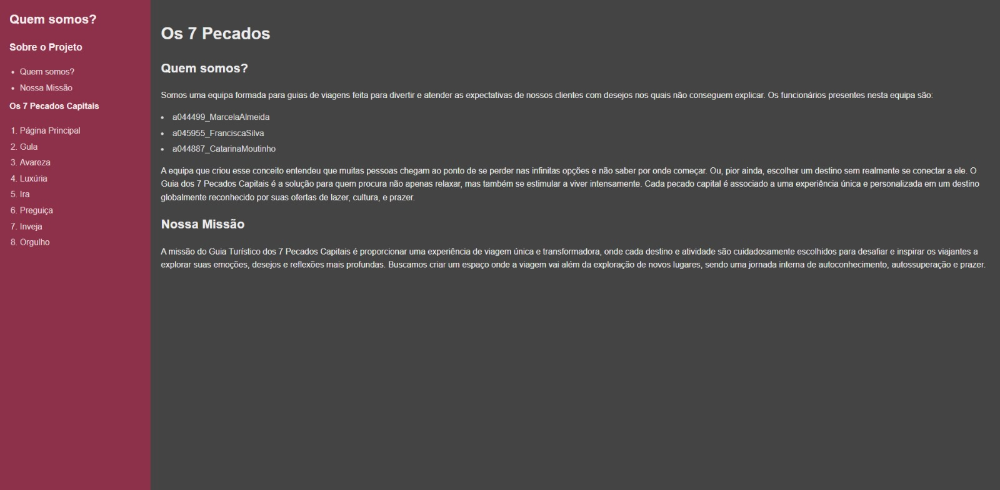
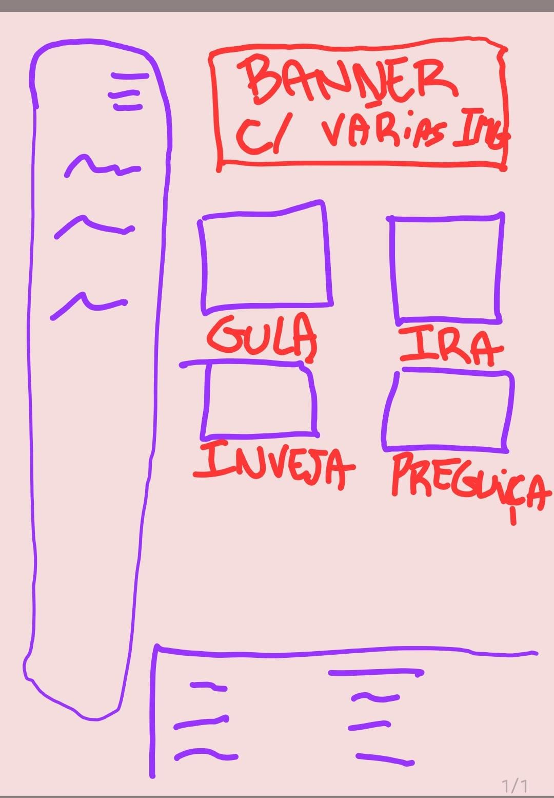

# Interface do Utilizador
## Rascunhos:
O design inicial foi planejado com base em sketches e wireframes que definiram a estrutura de cada página e a hierarquia de informações. 
## Interface and Common Features
No primeiro passo, fizemos um sketch desenhado no bloco de notas para possuir uma visão do que gostaríamos para o site e o melhor posicionamento dos elementos no site. Inicialmente, tínhamos feito um sketch de um site, mas foi descartado pois não apresentava apelo visual necessário para os clientes e era pouco funcional, por isso refizemos o sketch com uma ideia nova e mais funcional. Após estarmos confortáveis com a ideia, partimos uma representação mais detalhada do layout do site, criando um wireframe feito no Figma para melhor na organização dos elementos e da hierarquia de informações.
## Sketchs
| | |
:---: | :---:
 | 
Sketch inicial com foco nos aspectos fundamentais do projeto. Elementos supérfluos ou pouco necessários para o desenvolvimento estão presentes nessa versão inicial, com muitos elementos que desviam a atenção do utilizador. Por estes motivos mudamos o sketch para outro. |  Um Sketch novo que captura a atenção do utilizador de forma clara, intuitiva e atrativa. O design desta vez é mais focado na usabilidade e funcionalidade com elementos que possam facilitar a navegação. 

### Wireframes
| | |
:---: | :---:
 

Decidimos usar o sketch novo e criamos o wireframe baseado nele. Após a definição do Wireframe, iniciamos o projeto com a criação de um sitemap. Essa decisão serve como uma representação organizada das páginas ou seções do projeto, permitindo uma visão clara da estrutura do conteúdo e das interações esperadas pelo utilizador durante a jornada pelo site em sua estrutura oficial. Desta forma, estruturamos o sitemap da seguinte forma.

