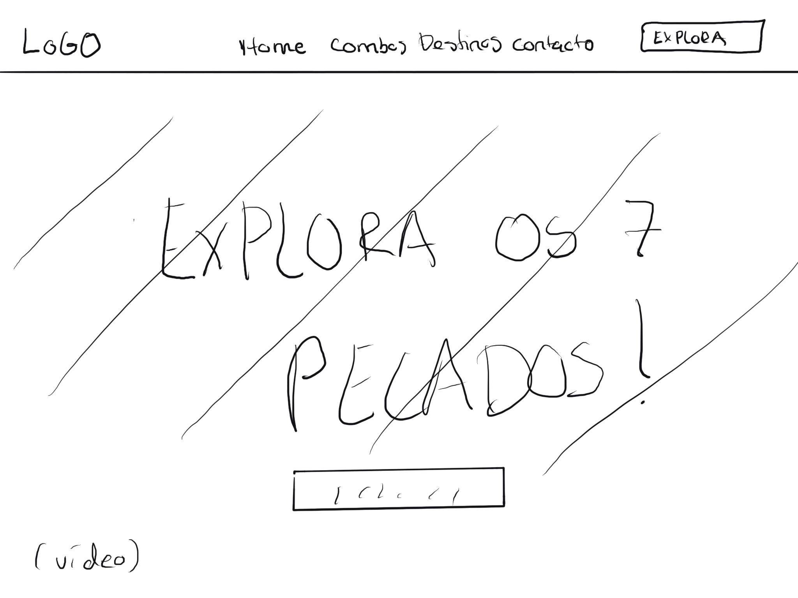
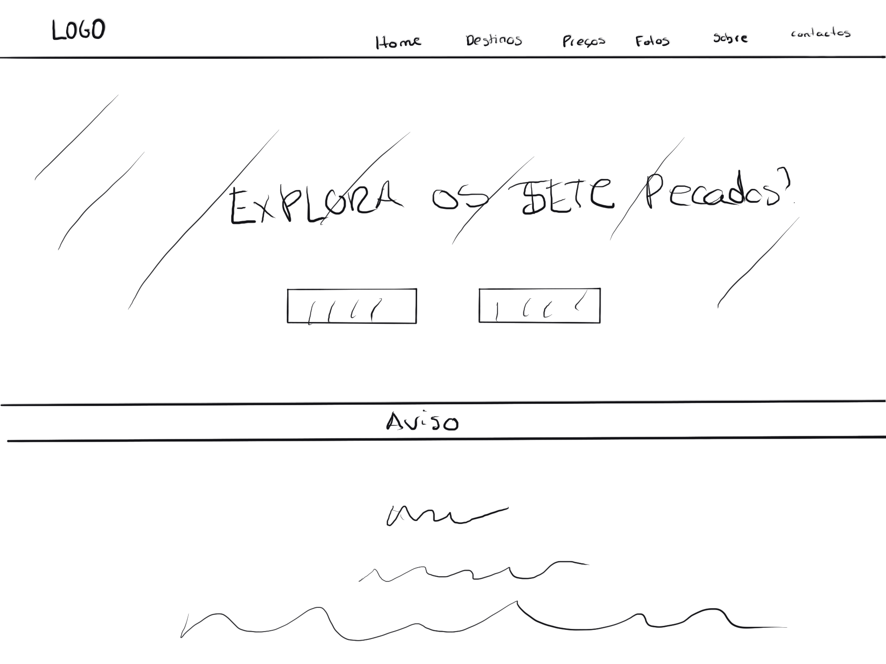

# Interface do Utilizador
## Rascunhos:
O design inicial foi planejado com base em sketches e wireframes que definiram a estrutura de cada página e a hierarquia de informações. 
## Interface and Common Features
No primeiro passo, fizemos um sketch desenhado no bloco de notas para possuir uma visão do que gostaríamos para o site e o melhor posicionamento dos elementos no site. Inicialmente, tínhamos feito um sketch de um site, mas foi descartado pois não apresentava apelo visual necessário para os clientes e era pouco funcional, por isso refizemos o sketch com uma ideia nova e mais funcional. Após estarmos confortáveis com a ideia, partimos uma representação mais detalhada do layout do site, criando um wireframe feito no Figma para melhor na organização dos elementos e da hierarquia de informações.

## Sketchs

| | |
:---: | :---:
 | 
Esta página inicial inclui um menu principal fixo na parte superior com as opções de navegação: Home, Combos, Destinos, Contacto e um botão adicional “Explora”. No centro da página, destaca-se a mensagem principal: “Explora os 7 Pecados!”, acompanhada de uma área dedicada para um vídeo ou elemento interativo, como um botão de ação. |  Menu superior atualizado, agora incluindo as secções “Preços”, “Fotos” e “Sobre”. A mensagem principal “Explora os Sete Pecados” aparece novamente com botões de interação  para facilitar a navegação. Adição de uma secção informativa ou de aviso na parte inferior.

### Wireframes
![An alternative description]

Decidimos usar o sketch novo e criamos o wireframe baseado nele. Após a definição do Wireframe, iniciamos o projeto com a criação de um sitemap. Essa decisão serve como uma representação organizada das páginas ou seções do projeto, permitindo uma visão clara da estrutura do conteúdo e das interações esperadas pelo utilizador durante a jornada pelo site em sua estrutura oficial. Desta forma, estruturamos o sitemap da seguinte forma.

