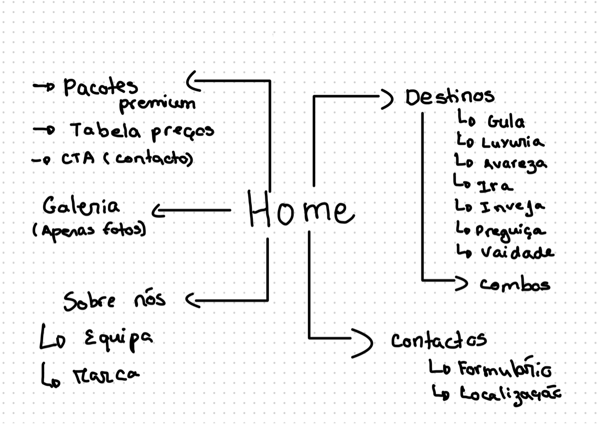
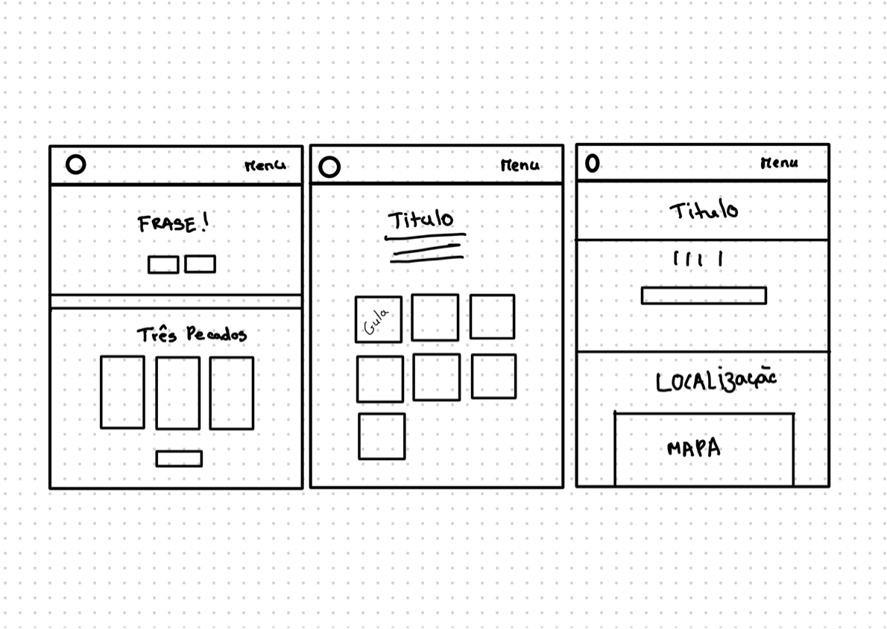

# Interface do Utilizador
## Rascunhos:
O design inicial foi cuidadosamente planeado com base em sketches e wireframes que ajudaram a definir a estrutura de cada página e a hierarquia das informações. Os **sketches** foram os primeiros passos no processo criativo, permitindo uma visão geral das ideias e do posicionamento dos elementos no site. Posteriormente, os **wireframes** foram criados para detalhar e organizar melhor o layout, garantindo que a navegação e a experiência do utilizador fossem intuitivas e funcionais. 

## Interface e recursos comuns
O design inicial do site foi cuidadosamente planeado através da criação de sketches e wireframes que definiram a estrutura de cada página e a hierarquia de informações. Como primeiro passo, realizámos um sketch desenhado manualmente num bloco de notas (digital), permitindo-nos visualizar as ideias iniciais e testar o melhor posicionamento dos elementos no site. Contudo, a primeira versão deste sketch foi descartada por não apresentar o apelo visual necessário para atrair clientes e por ser pouco funcional. Assim, criámos um novo sketch que refletisse uma abordagem mais funcional e visualmente apelativa.

## Sketchs

| | |
(
)
Esta página inicial inclui um menu principal fixo na parte superior com as opções de navegação: Home, que seria ao clicar no logotipo, Sins, onde teriamos a página sobre a Gula, a Preguiça e o Orgulho, About Us e Contact. No centro da página, destaca-se a mensagem principal: “Explore the routes of the 7 deadly sins while traveling the world.”, acompanhada de uma área dedicada para um vídeo ou elemento interativo, como um botão de ação. 
### Sitemap

 
O sitemap do website "Sins & Suitcases" apresenta uma estrutura organizada e intuitiva. A página principal, Home, funciona como o ponto de partida. A secção Pacotes (posteriormwnte chamada preçário) inclui opções de pacotes premium, uma tabela de preços e um botão de "Call to Action" (CTA) para contacto direto. Na área de Destinos, os locais estão divididos pelos sete pecados capitais: Gula, Luxúria, Avareza, Ira, Inveja, Preguiça e Vaidade, facilitando o acesso a cada temática. A Galeria é dedicada exclusivamente a fotos ilustrativas relacionadas aos destinos e pacotes. Na secção Sobre Nós, encontram-se informações institucionais sobre a equipa e a história da marca. Por fim, a página Contactos inclui um formulário de contacto e informações de localização, permitindo uma comunicação direta com a agência. Esta organização foi pensada para proporcionar uma navegação simples e eficiente, garantindo uma experiência agradável para o utilizador.

### Wireframes
 
O esboço apresentado consiste em três páginas principais do site: a página inicial, a página de destinos e a página de contacto.
A página inicial destaca-se por apresentar uma frase de impacto no topo, servindo como um convite ou introdução ao tema do site. Logo abaixo, há botões que  levam a diferentes áreas do site. A secção principal é ocupada por três categorias representativas dos pecados, dispostas em blocos, com um botão adicional que direciona para mais informações .
A página de destinos foca nos sete pecados capitais, que são apresentados em formato de grelha, utilizando quadradospara cada pecado. Este design sugere uma navegação interativa, onde cada elemento leva o utilizador a informações específicas relacionadas ao tema.
A página de contacto inclui um título principal que identifica a funcionalidade da página. Abaixo, há um formulário de contacto para os utilizadores preencherem e enviarem mensagens. Na parte inferior, há a inclusão de um mapa, que serve para indicar a localização física da empresa.
